# youtube_data_engineering
An end-to-end data engineering project for analyzing YouTube data, encompassing data ingestion, data lake formation, cloud deployment on AWS, ETL design, scalability, and reporting. This repository includes scripts, workflows, and documentation to guide users through each phase of the project, leveraging Python, AWS services, and data engineering best practices.

### Data Management Strategy

**Data Ingestion**: Develop a mechanism to efficiently ingest data from various sources.

**ETL System**: Implement an ETL (Extract, Transform, Load) process to convert raw data into a usable format.

**Data Lake**: Establish a centralized repository to store data from multiple sources, ensuring easy access and management.

**Scalability**: Design the system to scale seamlessly as data volume increases.

**Cloud Integration**: Utilize cloud services, specifically AWS, to handle the processing of large datasets that exceed local computing capabilities.

**Reporting**: Create a dashboard to provide insights and answers to the predefined questions.

### Amazon Web Services (AWS) Overview
`Amazon S3`: Amazon Simple Storage Service (S3) is an object storage service offering industry-leading scalability, data availability, security, and performance.

`AWS IAM`: AWS Identity and Access Management (IAM) enables secure management of access to AWS services and resources. It allows for the creation and control of AWS users and permissions.

`Amazon QuickSight`: QuickSight is a scalable, serverless, and embeddable business intelligence (BI) service powered by machine learning. It is designed to provide fast and actionable insights from your data.

`AWS Glue`: Glue is a serverless data integration service that simplifies the process of discovering, preparing, and combining data for analytics, machine learning, and application development.

`AWS Lambda`: Lambda is a serverless computing service that lets developers run code without provisioning or managing servers. It automatically scales and manages the compute resources needed to run your code.

`AWS Athena`: Athena is an interactive query service that makes it easy to analyze data directly in Amazon S3 using standard SQL. There is no need to move your data; it remains in S3.

### Dataset Used

The dataset utilized is from Kaggle and contains comprehensive statistics on daily popular YouTube videos over an extended period. It includes up to 200 trending videos published daily across various regions, with each region's data stored in its own CSV file. The dataset encompasses several attributes such as video title, channel title, publication time, tags, views, likes, dislikes, description, and comment count. Additionally, it features a `category_id` field specific to each region, which is detailed in the accompanying JSON file.

You can access the dataset [here](https://www.kaggle.com/datasets/datasnaek/youtube-new).


### Architecture Diagram

<p align="center"></p>

### Lake House Architecture Diagram

<p align="center">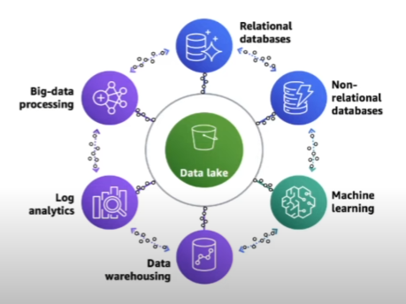</p>

### AWS Glue Catalog Diagram

<p align="center">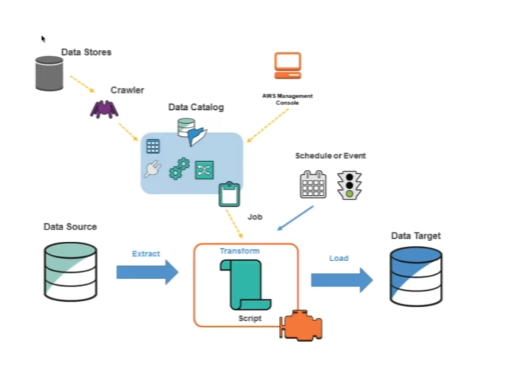</p>

<p align="center">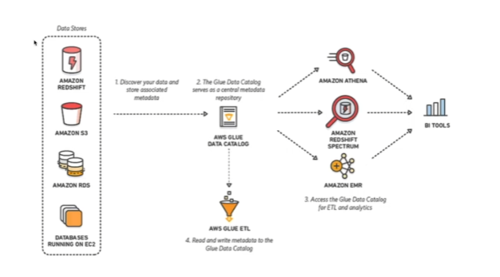</p>

### Project Overview

The requirement from `(simulated)` customer:
- Launching new data-driven campaign
- Main advertising channel: `Youtube`
- Initial question to answers:

1. "How to categorise videos, based on their comments and statistics?"
2. "What factors affect houw popular a YouTube video `will be`?"
  
**Why Youtube, as leading platform for advertisement usage?**

YouTube is on of the top three most-visited websites (monthly) after google.com

*source: [Exploding Topics - Most Visited Website in The World (June 2024), by Josh Howarth, published on 1st June 2024](https://explodingtopics.com/blog/most-visited-websites)*

### On-premise Data Centre vs. Cloud Data Centre

In cost wise, it is efficient to use Cloud Based. In this project we will explore on Amazon Web Services (AWS) which the leading cloud platform next to Microsoft. We can call it one-stop center for cloud services, since many services they offers.

### Data Engineering Process

1. `CREATE AN AWS ACCOUNT`: Click [here](https://portal.aws.amazon.com/billing/signup#/start/email). If, this is your first time login into AWS Dashboard Account, to access the services, you need to activate, by inserting payment method then follow the verification steps. If you already have an account, just sign in into your IAM role account, if you don't have, follow next instruction.
2. `CREATE AWS IAM ROLE ACCOUNT`: Again if you already have an IAM role account you can skip this step. to create and IAM role account, search and click `IAM`, then click  `Users`, then click `add users`. during IAM account setup, here are some component keys that you need to focus on; username, IAM role (programmatic access), passwords, attached existing policies (select AdministratorAccess), download the csv (and save it at secure location). Once IAM role account created, and create new access key and download the csv file once you completed creating access key ( access key, allowing us to pair with other tools to use with the account). Now, you have successfully created the IAM role account together with the secret key, login the IAM account via link given in the csv. that you download earlier.
3. `SETTING UP AWS CLI ON YOUR DEVICE`: You can link your device to install [AWS CLI](https://aws.amazon.com/cli/) either MAC, Windows or Linux. Setting this up will help you fasten up the process. Then, configure your CMD (if using Windows) or Terminal (if using MAC) by inserting command `aws configure` then the system will prompt question like access key, secret access key, region.
4. `SETTING UP AWS S3 BUCKET`: Next, you can go to AWS console (under IAM role account), then create new S3 Bucket. you can name it whatever you want, in this project, I've named my bucket `my-yt-data-analysis-bucket`. <p align="center">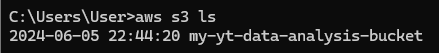</p>
5. `DOWNLOAD FROM KAGGLE`: Now, we can proceed to download the applicable data from kaggle, what I've mentioned earlier, download [here](https://www.kaggle.com/datasets/datasnaek/youtube-new). Save it at proper designated folder. Then, direct your `terminal` or `cmd` to the designated folder that you've just save ealier. using `cd` command to change your directory.
6. `UPLOAD FILE FROM YOUR DEVICE TO S3 BUCKET`: Now, as your command line interface in the at correct directory to upload the files. use the command below to start upload json & csv files. Copy the command below and paste on the command line interface.

```shell
aws s3 cp . s3://my-yt-data-analysis-bucket/youtube/raw_statistics_reference_data/ --recursive --exclude "*" --include "*.json"
```

Next, since the csv files information is from differents region, so each file is design to go onto diferrent directory.

```shell
aws s3 cp CAvideos.csv s3://my-yt-data-analysis-bucket/youtube/raw_statistics/region=ca/
aws s3 cp DEvideos.csv s3://my-yt-data-analysis-bucket/youtube/raw_statistics/region=de/
aws s3 cp FRvideos.csv s3://my-yt-data-analysis-bucket/youtube/raw_statistics/region=fr/
aws s3 cp GBvideos.csv s3://my-yt-data-analysis-bucket/youtube/raw_statistics/region=gb/
aws s3 cp INvideos.csv s3://my-yt-data-analysis-bucket/youtube/raw_statistics/region=in/
aws s3 cp JPvideos.csv s3://my-yt-data-analysis-bucket/youtube/raw_statistics/region=jp/
aws s3 cp KRvideos.csv s3://my-yt-data-analysis-bucket/youtube/raw_statistics/region=kr/
aws s3 cp MXvideos.csv s3://my-yt-data-analysis-bucket/youtube/raw_statistics/region=mx/
aws s3 cp RUvideos.csv s3://my-yt-data-analysis-bucket/youtube/raw_statistics/region=ru/
aws s3 cp USvideos.csv s3://my-yt-data-analysis-bucket/youtube/raw_statistics/region=us/
```

*additional notes: as for linux or mac we can use `ls` command on the CLI to list the files, but in windows use this command `dir /s /b /o:gn`. You're welcome.

Once all files uploaded into the S3 bucket, here how your S3 will looks like. <p align="center">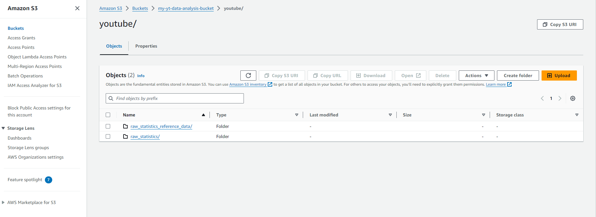</p>

7. `IMPLEMENTING LAKE HOUSE ARCHITECTURE`: Before we go deep, we need to understand the key elements of the lake house architecture. Scalable Data Lakes, Purpose-built Data Services, Seamless Data Movement, Unified Governance & Performance and Cost-effective. Next, we will setup AWS GLUE.
8. `AWS GLUE FOR DATA INTEGRATION`: When you done uploading the files into S3 Bucket, now, go to `AWS GLUE` then click at `CRAWLER` at the left navigation pane. Create `new crawler` and name it whatever you want,  in this project I've named it as `de-yt-glue-catalog-1`,and for my case, I kept everything in default. Ensure you are using correct S3 Bucket (which contain json file, in this context the directory s3://my-yt-data-analysis-bucket/youtube/raw_statistics_reference_data/, then create new IAM role for this AWS GLUE section. Now, take closer attention for this, open new tab, and go to AWS IAM, click `role` section. Create new role, the choose AWS Service and choose `Glue` for `use cases for other AWS services:`. For permission policies, select `AmazonS3FullAccess` & `AWSGlueServiceRole` then name the role. In this project I've named it as de-on-yt-glue-s3-role. Now get back to the prev tab `AWS Glue - crawler` that we left just now. refresh the `Choose the IAM role` and the select the `de-on-yt-glue-s3-role` that we just create earlier. then Create new database for this, in my case i've create `de_youtuber_raw` databases, then select the database you just created, then click next until you complete setting up the crawlers. Then select the crawler that we just created, then select `RUN Crawler`. Then once it's complete it will fetch data and create and table analysis on what the json file is all about. <p align="center">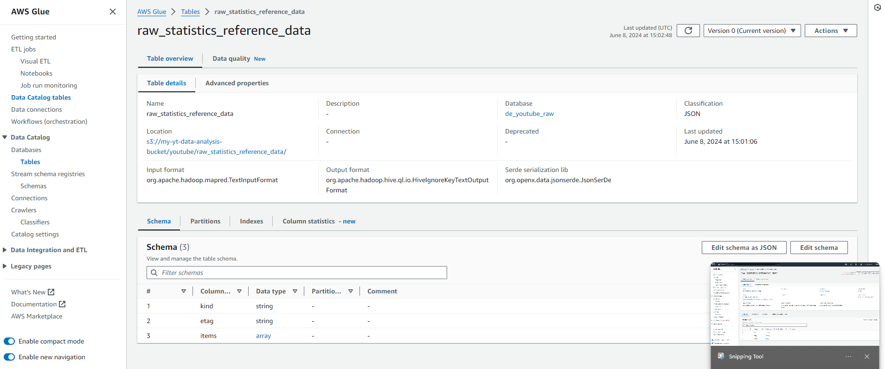</p>
9. `QUERYING WITH AMAZON ATHENA`: Next, we will go to Amazon Athena to querying the data. First, at Amazon Glue page, at the left navigation bar, open drop down menu for `Data Catalog`, then select `Tables` under Databases, Then click the table that crawler just created earlier, then at the top right corner, click `Action`, then click `View data`, then it will lead to new page, amazon Athena. What is Athena? Athena is ad-hoc query tool which use SQL programming language. Now, at the top of the bar you will popup message asking 'Before you run your first query, you need to set up a query result location in Amazon S3'. Basically, we need to create new S3 bucket to save the athena query data. <p align="center">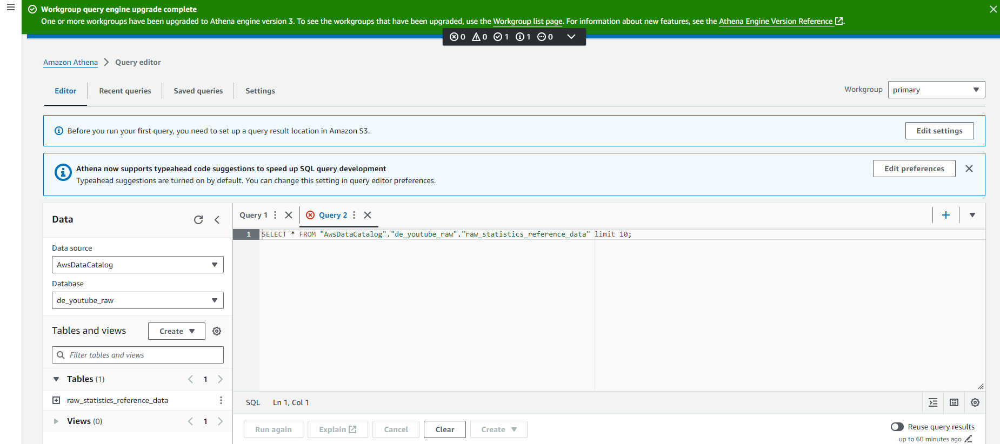</p>. In this case I've named my new S3 bucket as `my-yt-de-athena-bucket` <p align="center">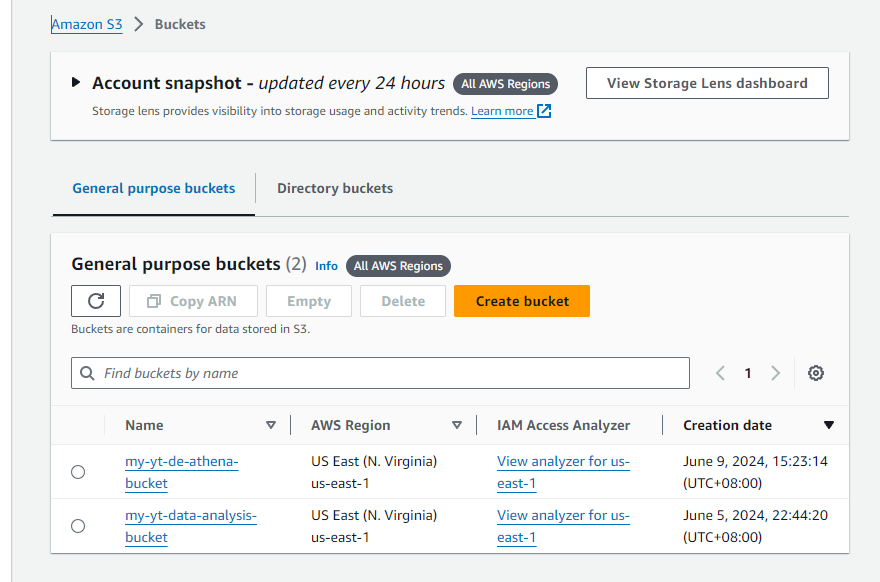</p>. Now, we have everything in place, we start to `RUN` the Athena, but what was the outcome? it was fail, due to our file in json is giving information in wrong format, eventhough it is correct, but based on AWS Guideline, it was not correct. <p align="center">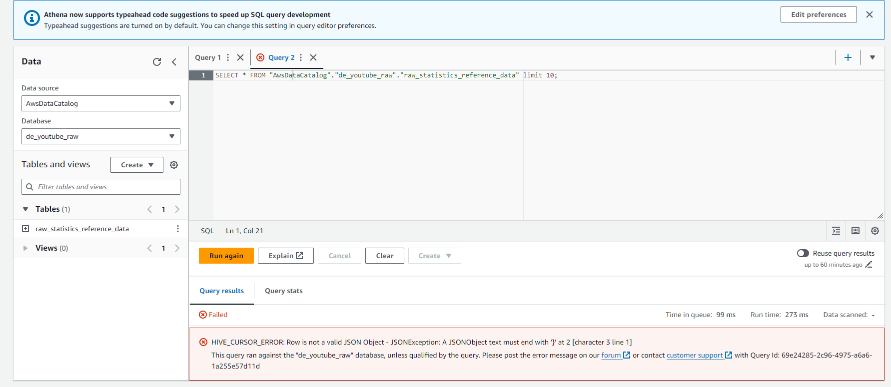</p> Here, is one part of Data Engineering process which to clean up data to make it workable, which we call it `Data Cleansing`. <p align="center">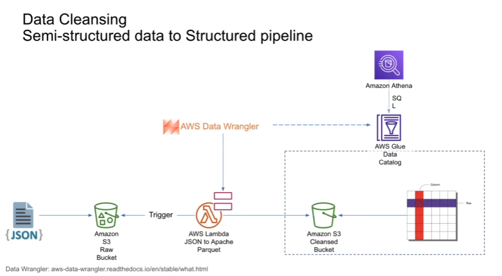</p> <p align="center">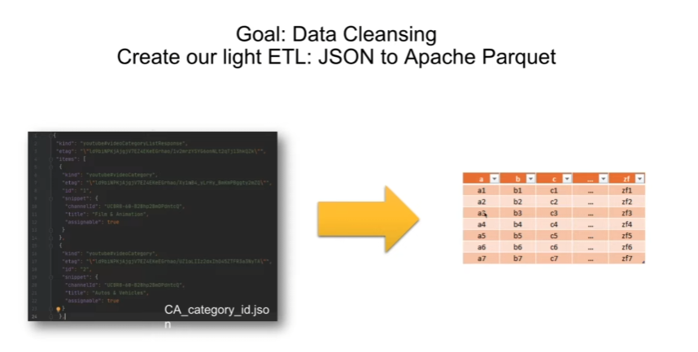</p>
10. `LAMBDA - DATA CLEANSING PROCESS`: as part for data cleansing, I'm using aws lamda to convert from json to Apache Parquet. <p align="center">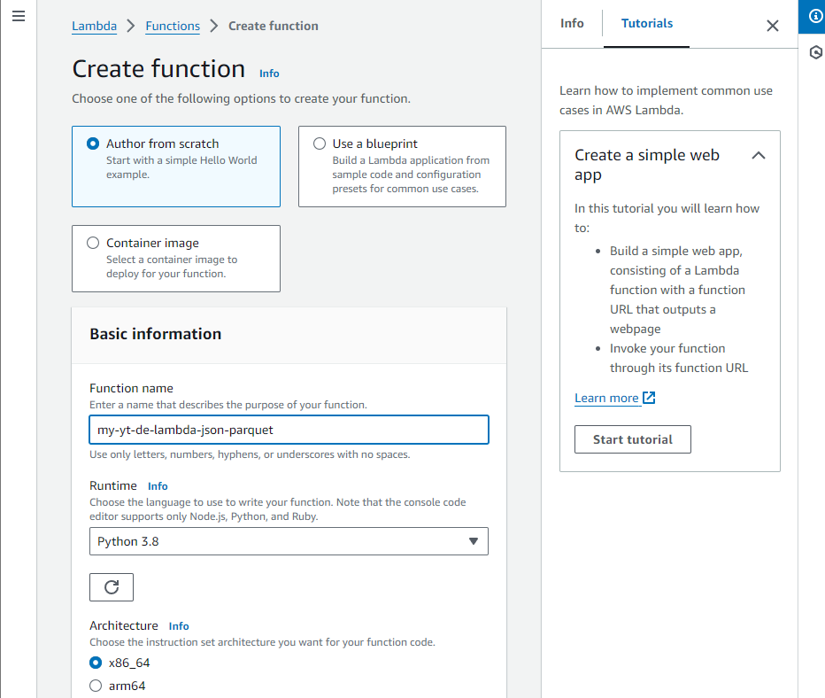</p> We will required to create new role, allowing for this operation. go to IAM page, select `role` tab at navigation left pane, then, `create new role` then select `lambda` as for service, give permission on `Amazons3FullAccess` and `AWSGlueServiceRole` create the role. <p align="center"></p> Once you have create the IAM role, go back to AWS lambda page, choose the role, that we just created earlier, then `create function`. Upon completing the setting the function, the system will forward us to the AWS lambda page. <p align="center">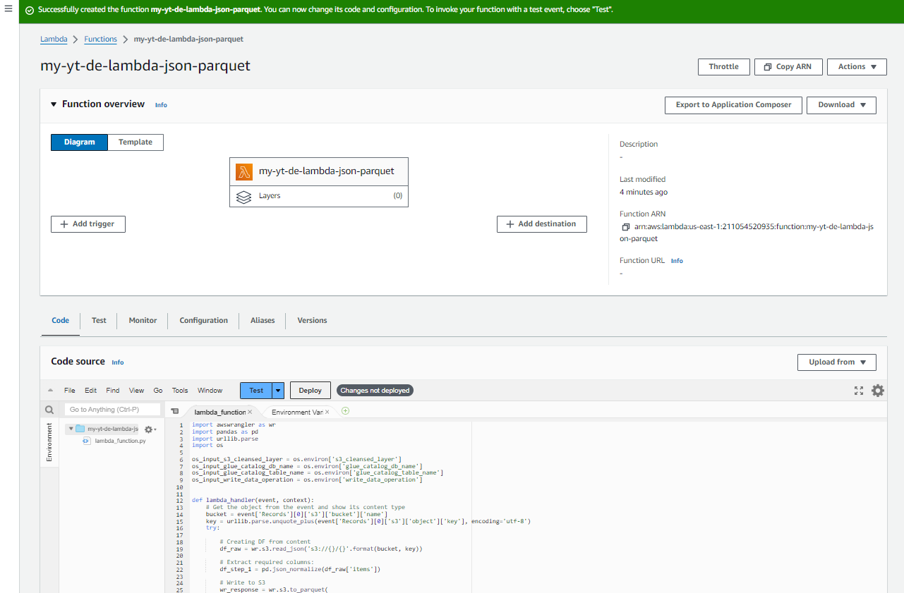</p> In this page, you will need to setup a python code which reading the file from S3, normalise, then extract the items, then write back in parquet format to S3, 
```python
import awssdkpandas as wr
import pandas as pd
import urllib.parse
import os

os_input_s3_cleansed_layer = os.environ['s3_cleansed_layer']
os_input_glue_catalog_db_name = os.environ['glue_catalog_db_name']
os_input_glue_catalog_table_name = os.environ['glue_catalog_table_name']
os_input_write_data_operation = os.environ['write_data_operation']


def lambda_handler(event, context):
    # Get the object from the event and show its content type
    bucket = event['Records'][0]['s3']['bucket']['name']
    key = urllib.parse.unquote_plus(event['Records'][0]['s3']['object']['key'], encoding='utf-8')
    try:

        # Creating DF from content
        df_raw = wr.s3.read_json('s3://{}/{}'.format(bucket, key))

        # Extract required columns:
        df_step_1 = pd.json_normalize(df_raw['items'])

        # Write to S3
        wr_response = wr.s3.to_parquet(
            df=df_step_1,
            path=os_input_s3_cleansed_layer,
            dataset=True,
            database=os_input_glue_catalog_db_name,
            table=os_input_glue_catalog_table_name,
            mode=os_input_write_data_operation
        )

        return wr_response
    except Exception as e:
        print(e)
        print('Error getting object {} from bucket {}. Make sure they exist and your bucket is in the same region as this function.'.format(key, bucket))
        raise e
```
After you paste the code, go to configuration tab, then go to environment variable (still in the AWS lambda). click on `edit`.  but before that, we need to create new S3 bucket, which in this case, I've named it as `my-yt-de-cleansed-bucket` then insert key and value similar like this (ensure for S3 bucket you put S:// following the name of the bucket) <p align="center"></p> Next, (still in the AwS lambda page) select `test` tab, and click `test dropdown menu` select `configure test event` then in the configuration, under template choose `s3-put` then go to s3 bucket raw files (the first s3 bucket we created earlier) then copy the `s3 URI` here the example once you copied it `s3://my-yt-data-analysis-bucket/youtube/raw_statistics_reference_data/CA_category_id.json`, for examples bucket: select **ONLY** `my-yt-data-analysis-bucket` and for test%2Fkey: **ONLY** youtube/raw_statistics_reference_data/CA_category_id.json, refer image for better understanding on the setting <p align="center">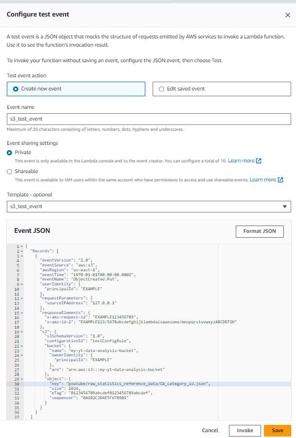</p> Then to avoid any error, we need to set up `add layer` <p align="center">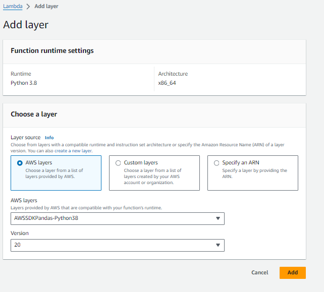</p> Next we need to increase time out in the lambda processing system by 5 min. <p align="center"></p> <p align="center">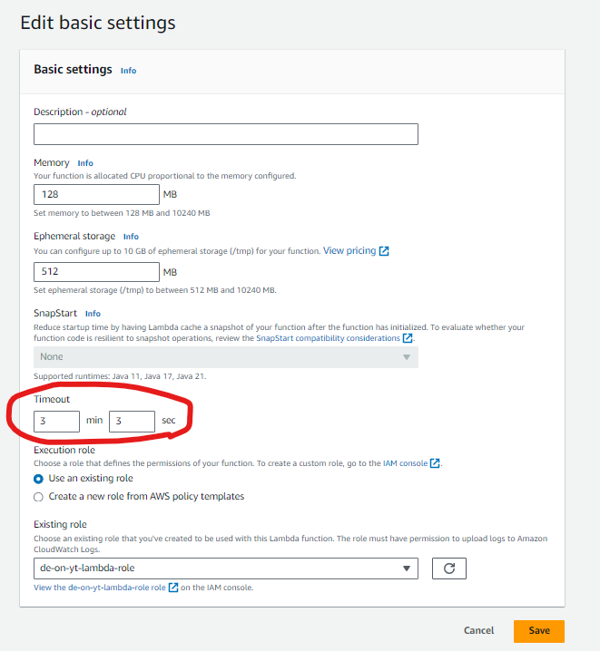</p>  Then go to AWS GLUE, click `database` then `add database` and named it as `db_youtube_cleaned` then go to AWS lambda page, click `deploy` <p align="center">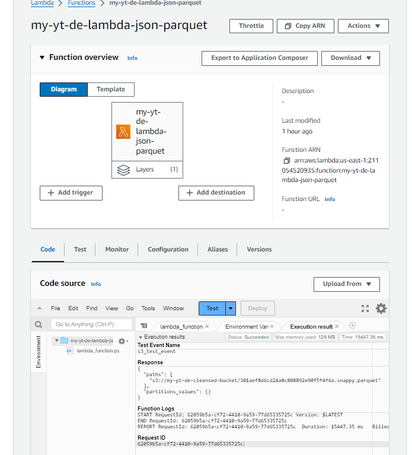</p> to check is the function is working go to `AWS GLUE` under database, you can see that new file generated based on file we select earlier <p align="center">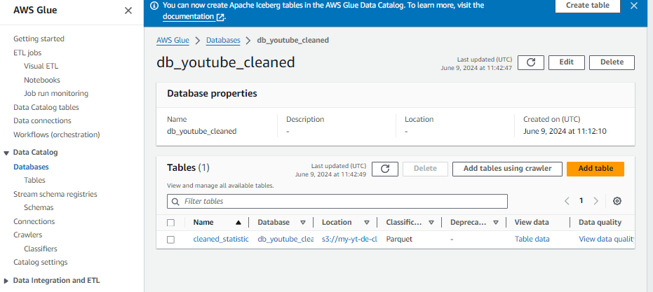</p> Congratulations! we have complete create function that convert file from json to apache parquet.

11. `APPEND CLEANED TABLED IN DB USING AWS GLUE`: Now, we have successfully created the cleaned file version, however, there are some slight input that we need to adjust after the file is created. Go to `AWS GLUE`, go to the cleansed db that we just created, then, adjust the `id` to change from `string` to `bigint` <p align="center">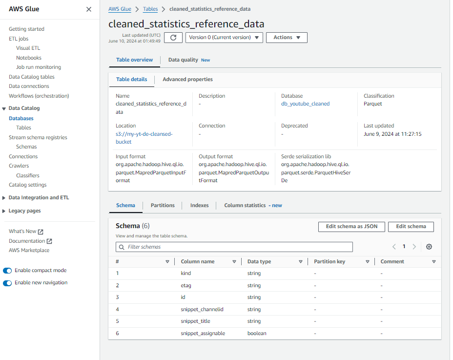</p> <p align="center">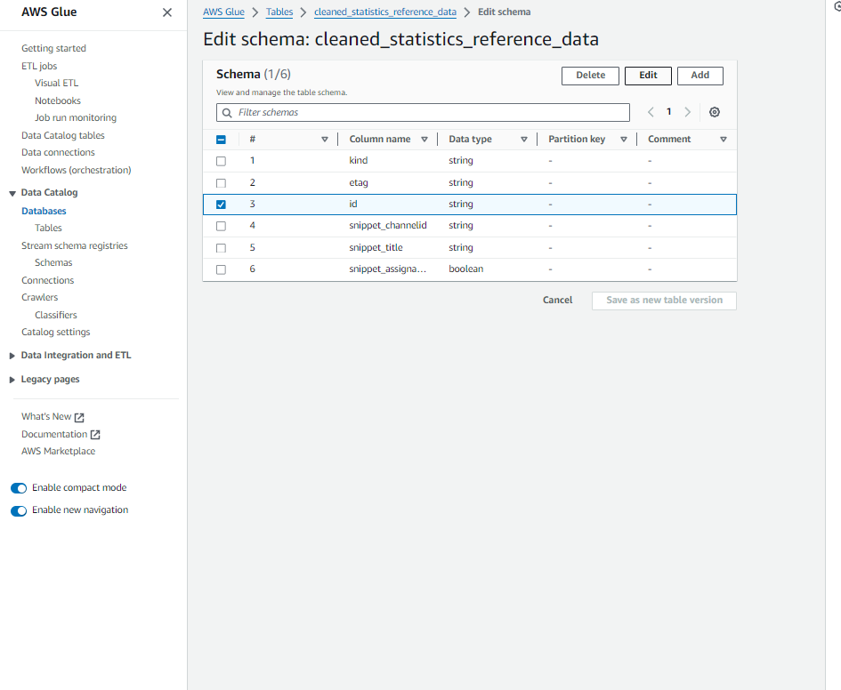</p> <p align="center">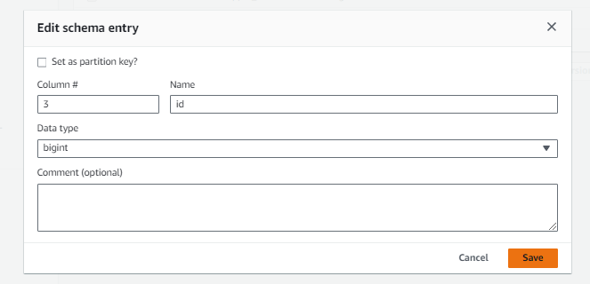</p> Steps for this append and changes, first keep the data type change in the data catalogue, then, delete our testing JSON file. After that, confirm APPEND in lambda, then copy again our data, through `AWSCLI`. Lastly, add the S3 trigger to Lambda.
12. `DELETE THE CLEANED TABLED IN S3 BUCKET`: First we open new tab, and go to the `S3` then, over there, find the cleansed bucket we created previously, in my case I've named it as `my-yt-de-cleansed-bucket`, then search the parquet file we created, then delete it. <p align="center">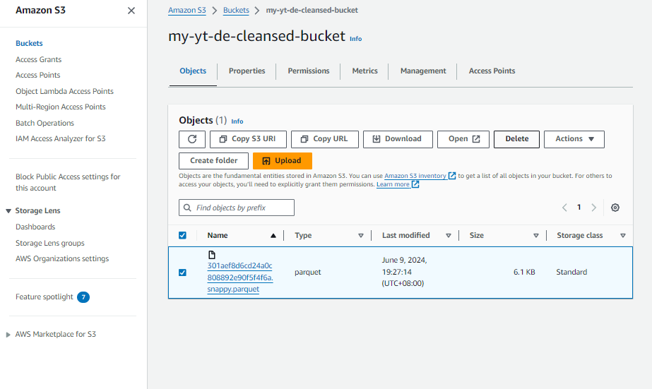</p>.
13. `INSTALL AWS WRANGLER`: Some of you might find this funny, but I got wasted when the system is not function, so here one of the devops thing that I've done, install AWS Wrangler at AWS CLI
```bash
pip install awswrangler
```
<p align="center">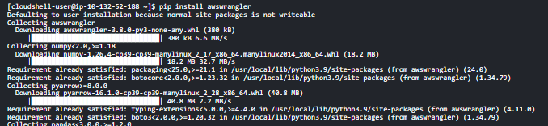</p>.

14. `RECREATE THE PARQUET FILE`: Run again the lambda function with similar setting we created previously.
15. `PLAY AROUND IN ATHENA`: AWS Athena contain features that we can fetch information from storage, in this context S3 bucket that we have been created and used in awhile, Athena use `SQL` programming language, so have familiarity in the SQL would be in handy, if you dont have any skill on that, just play along with this project. In my case, I got issue which athena can't fetch information in the data, so here is my solution inserting in the query.

```SQL
CREATE EXTERNAL TABLE IF NOT EXISTS raw_statistics_reference_data (
  kind string,
  etag string,
  id bigint,  -- Added column for id
  snippet_channelid string,  -- Added column for snippet_channelid
  snippet_title string,  -- Added column for snippet_title
  snippet_assignable boolean  -- Added column for snippet_assignable
)
ROW FORMAT SERDE 'org.apache.hadoop.hive.serde2.lazy.LazySimpleSerDe'
WITH SERDEPROPERTIES (
  'serialization.format' = ','
) 
LOCATION 's3://my-yt-data-analysis-bucket/youtube/raw_statistics/'
TBLPROPERTIES ('has_encrypted_data'='false');
```
```SQL
CREATE EXTERNAL TABLE `raw_statistics_reference_data`(
  `kind` string, 
  `etag` string, 
  `items` array<struct<kind:string,etag:string,id:string,snippet:struct<channelid:string,title:string,assignable:boolean>>>
)
ROW FORMAT SERDE 
  'org.apache.hadoop.hive.serde2.lazy.LazySimpleSerDe' 
WITH SERDEPROPERTIES ( 
  'serialization.format' = ',', 
  'field.delim' = ',' 
) 
STORED AS INPUTFORMAT 
  'org.apache.hadoop.mapred.TextInputFormat' 
OUTPUTFORMAT 
  'org.apache.hadoop.hive.ql.io.HiveIgnoreKeyTextOutputFormat'
LOCATION
  's3://your-s3-bucket/path/to/data/'
TBLPROPERTIES (
  'has_encrypted_data'='false'
)

```


```SQL
SELECT a.title,a.category_id,b.snippet_title FROM "de_youtube_raw"."raw_statistics" a
INNER JOIN "db_youtube_cleaned"."cleaned_statistic_reference_data" b ON a.category_id=b.id
where a.region='ca';
```


